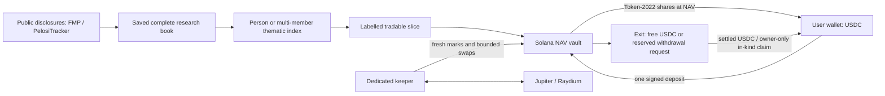

# Architecture

## Boundaries

- **Research:** `src/lib/fmp`, `tracker`, `thematic`, and the pure derivation modules in `index-vaults`. Supabase stores annual evidence and published definitions; committed source bundles retain provenance. Trades are information, not reconstructed balances. Disclosed books are never filtered by liquidity.
- **Investable slice:** `src/lib/nav-vault/slices.ts` and `tradable-slices.json`. Kept weights are renormalized; every excluded name retains a reason. The published slice table is preferred, with the committed snapshot as fallback, only when its mint set matches the on-chain vault.
- **Program:** `programs/nav-vault/src/lib.rs`. One PDA vault per index ID, PDA-owned inventory, and its own Token-2022 share mint. Share supply and token balances—not purchase rows—define ownership. NAV excludes inventory reserved for withdrawal requests.
- **App:** `src/lib/nav-vault/server.ts` / `prepare.ts` read chain state and build unsigned transactions. `src/components/vault-flow.tsx` validates preparation, asks the wallet to approve, confirms signatures and polls observed positions. After confirmation it announces the change (`src/lib/frontend/position-refresh.ts`); every mounted position view refetches at once, shows "Updating…" and re-reads every 3 s for up to 30 s until the chain read shows the new share balance, and refetches on window focus. The web server never loads a keeper or admin keypair.
- **Keeper:** `scripts/nav-vault-cli.mts` and `src/lib/nav-vault/keeper.ts`. Separate signing process with an explicit file-path key; posts marks and manages free inventory/withdrawal requests. See [keeper.md](keeper.md).

## Public API map

| Endpoint | Purpose |
| --- | --- |
| `GET /api/nav-vault?ids=<comma-separated IDs>` | Batched on-chain existence/readiness |
| `GET /api/nav-vault/[id]` | NAV identity, readiness, target weights and slice disclosure |
| `GET /api/nav-vault/[id]/position?wallet=<pubkey>` | Display name, share balance, marked value, pro-rata free on-chain holdings and pending requests |
| `POST /api/nav-vault/[id]/deposit/prepare` | Unsigned deposit (`owner`, `amountRaw`) |
| `POST /api/nav-vault/[id]/withdraw/prepare` | Unsigned exit (`owner`, `shareAmountRaw`) |
| `POST /api/nav-vault/[id]/claim/prepare` | Remaining in-kind claim chunks |
| `GET /api/positions/indexes?wallet=<pubkey>` | Wallet positions across NAV vaults (one owner-scoped request scan, vaults read in parallel) |
| `GET /api/vault-indexes` | Research definitions; not authority to sign |
| `GET /api/people`, `/api/tracker-profiles`, `/api/thematic-indexes` | Source-backed discovery |
| `POST /api/rpc` | Same-origin wallet RPC; server credentials never returned |

Compatibility `/api/indexes/[id]/{deposit,withdraw}/prepare` and `/position` delegate to the same NAV handlers. Retired create/cycle/devnet routes are removed. Individual `/api/quote` and `/api/execute` copy trades remain separate; they do not mint index shares.

## Deployment

The Next.js app deploys on Vercel from `main`. The keeper runs separately and must keep marks fresh; a web deployment does not start it. PostgreSQL migrations are append-only deployment history, including inactive historical tables. Do not replay them against production or delete production rows to clean repository presentation.

Server and client NAV kill switches are `STOCKLANA_NAV_VAULT_DISABLED=1` and `NEXT_PUBLIC_NAV_VAULT_DISABLED=1`. Optional index allowlists narrow visibility. On-chain pause is a separate admin control and leaves holder recovery available. See [nav-vault.md](nav-vault.md) for safety and trust assumptions.
